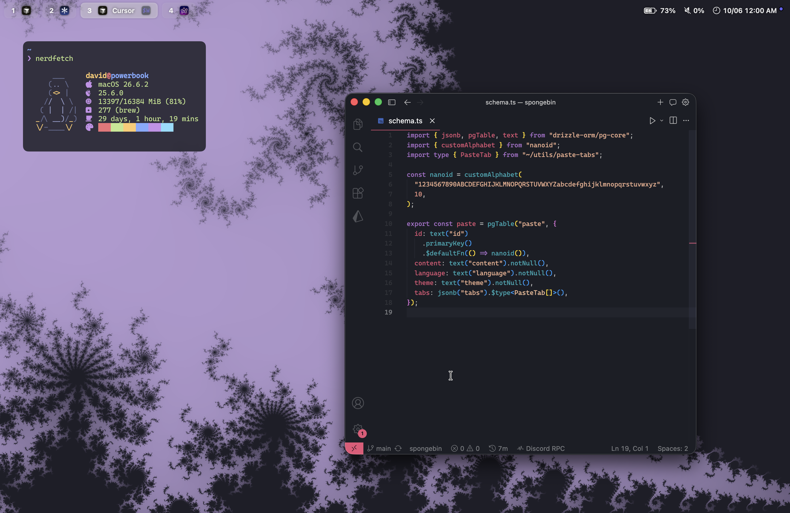

# dotfiles

these are my dotfiles for my macOS setup

# info

- tiling wm: [yabai](https://github.com/koekeishiya/yabai)
- status bar: [barik](https://github.com/DuroCodes/barik) (my fork of [vinhocent/barik](https://github.com/vinhocent/barik))
- terminal: [wezterm](https://github.com/wez/wezterm)
- shell: [fish](https://fishshell.com/)
- theme: [horizon](https://github.com/xynydev/horizon-theme)
- font: [caskaydia cove nerd font](https://www.nerdfonts.com/font-downloads)

